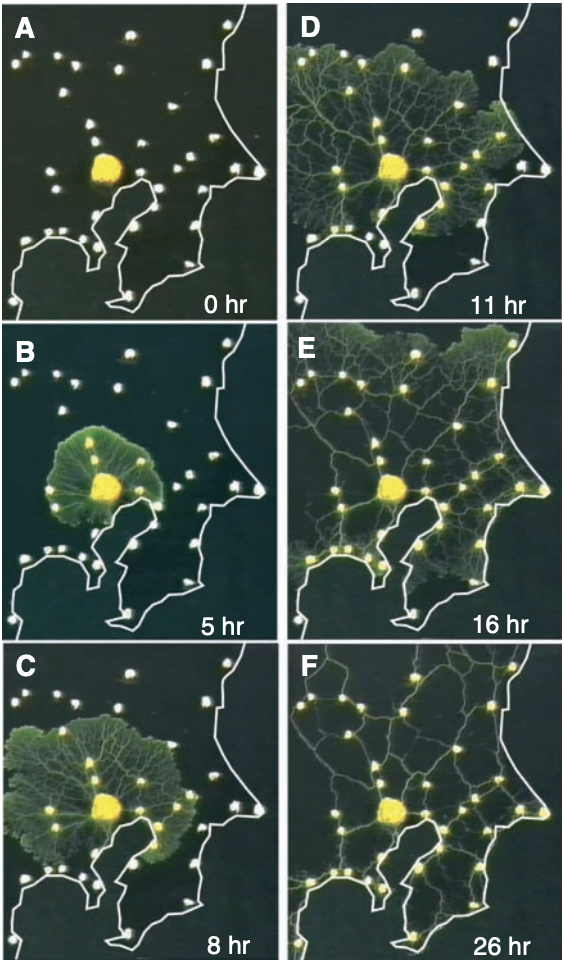
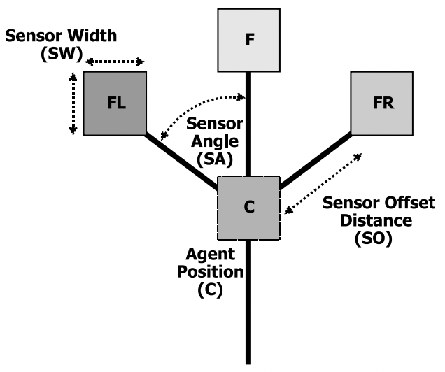
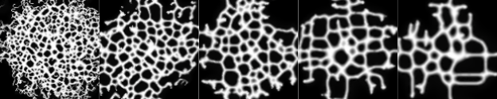
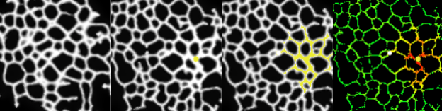
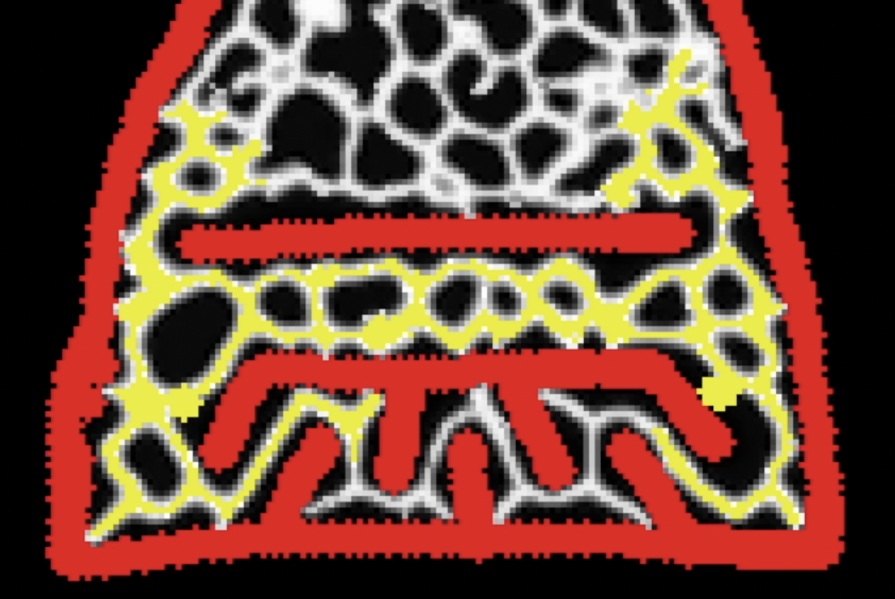

<html><head><meta content="text/html; charset=UTF-8" http-equiv="content-type"></head><body class="c18">

Heidacker, 

Mechanisms of Intelligent Pathfinding in Physarum Polycephalum

CS 372 Spring 2021

Nathan Heidacker

To download this model, please visit:

<a class="c25" href="https://www.google.com/url?q=https://github.com/nathanheidacker/physarum-polycephalum&amp;sa=D&amp;source=editors&amp;ust=1655958236546756&amp;usg=AOvVaw1uv_5yAZqInA2UWhymQvlB">https://github.com/nathanheidacker/physarum-polycephalum</a>

Reference Phenomenon

&nbsp;&nbsp;&nbsp;&nbsp;&nbsp;&nbsp;&nbsp;&nbsp;All life on earth must sustain itself through a constant process of nutrient intake. As the complexity of an organism increases--and especially as cognitive capacities arise--the difficulty and intricacy of this process increases in equal measure. In contrast, progression in the opposite direction conjures images of something approximating a purely chemical or even physical process. For the most basic forms of life, osmosis and movements across a chemical gradient alone may be sufficient to explain their ability to endure.

&nbsp;&nbsp;&nbsp;&nbsp;&nbsp;&nbsp;&nbsp;&nbsp;There are exceptions to this generalization, however, and modern science has yet to articulate a set of rules that can completely explain the complex behaviors of these otherwise simple organisms. Perhaps the most prevalent example of this biological irregularity is Physarum Polycephalum, a type of slime-mold that exhibits remarkably intelligent behaviors in its quest for self-preservation. Despite having no cognition or central nervous system to speak of, P. Polycephalum is not only capable of pathfinding through mazes, but also of selecting for the shortest paths between a network of food sources (Fig. 1).

&nbsp;

Fig. 1. &nbsp;Progression of network formation in Physarum Polycephalum. Food sources are plotted in the same formation as the Tokyo metropolitan transportation system (Tero et al., 2010).

&nbsp;&nbsp;&nbsp;&nbsp;&nbsp;&nbsp;&nbsp;&nbsp;Given the lack of complex systems that would typically enable such behavior, modeling P. Polycephalum using a set of distributed rules has become a relatively hot topic among a number of disparate disciplines. Biologists, mathematicians, and computer scientists alike have all contributed to the growing body of research that exists to discover the explanation for this unprecedented ability. Among that research, the greatest commonality that exists is the idea that the behavior is the consequence of a set of rules executed in a distributed fashion; intelligent pathfinding must be an emergent consequence of the implementation of some ruleset, executed by a simple biological network. 

&nbsp;&nbsp;&nbsp;&nbsp;&nbsp;&nbsp;&nbsp;&nbsp;

Prior Research

&nbsp;&nbsp;&nbsp;&nbsp;&nbsp;&nbsp;&nbsp;&nbsp;A number of competing theories have been proposed to explain the behaviors of P. Polycephalum, most of which vary wildly in their domain of scientific origin. Notably, there have been attempts to model the slime mold with sets of differential equations, distributed systems, and series&nbsp;of complex biochemical processes (Bonifaci, 2012). While some of these models produce results with some visual similarity, none have been able to act as valid explanations for the internal processes that dictate P. Polycephalum&rsquo;s behavior.

&nbsp;&nbsp;&nbsp;&nbsp;&nbsp;&nbsp;&nbsp;&nbsp;In my development of this model, rather than focusing on the implementation of a single ruleset, I opted to construct a set of mechanisms that borrowed from throughout the literature. Combining different methods in this way allowed me to push beyond the bounds of previous research that generated these networks computationally. The rules that I eventually settled on using in the model were primarily derived from just two research papers, both of which address very different aspects of the model&rsquo;s behavior. Accordingly, I find it most practical to introduce their influences on the model serially, as this implementation order is reflected in the model&rsquo;s development.

Physarum Polycephalum Network Generation

&nbsp;&nbsp;&nbsp;&nbsp;&nbsp;&nbsp;&nbsp;&nbsp;When exploring its environment, P. Polycephalum constructs a network of cytoskeletal tubes responsible for carrying the cytoplasmic fluid that acts as a nutrient and information transport network (Alim, Jones). The general process of forming these reticulated tubes in itself can be considered the first emergent behavior, requiring the interaction of thousands of agents that simulate the movement of cytoplasmic fluid particles.

&nbsp;&nbsp;&nbsp;&nbsp;&nbsp;&nbsp;&nbsp;&nbsp;Because a realistic fluid simulation would require the simultaneous computation of millions of particles, each agent instead represents a particular volume of fluid. This is accomplished by making agents emit a certain amount of fluid at each time step at their current position, which both dissipates and diffuses across the environment with time. Rates of fluid dissipation and diffusion (which collectively represent the total volume of fluid that any one agent can represent) allow a vast degree of control over the type, shape, and strength of structures that the network forms. 

Fluid particles are simulated by attaching a set of 3 sensors to the front of each agent. Each sensor measures the concentration of fluid ahead of the agent at a constant distance, which can be modulated to generate different network structures (Fig. 2). For the purposes of this model it is most accurate to use lower distances (~1 patch) because fluid particles have no &lsquo;vision&rsquo; to speak of and are not actively sensing the environment ahead of them, but rather traveling in the direction of the fluid concentration gradient. Owing to similarly physics-based intuitions, fluid particle sensors only face forward; the movement of the fluid particle should be roughly restricted to the direction of its current momentum. Fluid particles can turn around completely, but it will take several time steps in order to do so.

Fig. 2.&nbsp; &nbsp;Agent sensor architecture, modulated by the angle between sensors and the distance offset (Jones, 2010).

Sensors perform a comparative measurement to determine the gradient of fluid concentration in a cone determined by the sensors&rsquo; positions. Agents then reorient themselves in the direction of this gradient, and apply a smaller but randomly determined rotation from that new heading. This random rotation or &lsquo;wobble&rsquo; represents fluid turbulence, and its strength is the primary determinant of the slime-mold&rsquo;s proclivity to create new branches along a tube rather than continue along those that already exist. 

This framework for physarum polycephalum network generation visually emulates the real phenomenon quite accurately. However, having the fluid agents represent both the cytoplasmic fluid and the cytoskeleton tube network rather than emulating them as distinct entities is a simplification that imposes some limitations on the temporal quality of the model. In a static sense, the model produces visualizations that are strikingly similar to real physarum networks, but viewed over time they are too malleable and overly dynamic, even without provocation from any kind of stimulus. In real physarum networks, fluid flows influence the formation of cytoskeleton tubes in a similar fashion, but the differences in the temporal resolution of the fluid and the cytoskeletal materials allows the network to reflect responses to local fluid changes over a much larger course of time. Because the model uses the cytoplasmic fluid as&nbsp;the cytoskeleton, they share the same temporal qualities, and the result is a model that adapts to its own circumstances too rapidly.

Network Reactions to Nutritive Stimuli

&nbsp;&nbsp;&nbsp;&nbsp;&nbsp;&nbsp;&nbsp;&nbsp;In the presence of a nutritive stimulus, P. Polycephalum will release a signaling chemical that is advected by the cytoplasmic fluid flows of the network, inducing the release of more signaling chemical&nbsp;elsewhere in the network. This signaling chemical induces greater fluid flow into the regions of the network that it reaches, subsequently increasing both tube strength and fluid velocity within the tube (Alim, 2017). Tubes that are affected by the chemical therefore experience hypertrophy as they grow in size and require more of the network&rsquo;s limited supply of cytoplasmic fluid. Because the total volume of fluid in the network is limited, paths that are unaffected by the signaling chemical experience atrophy as less fluid is available to flow through them.

&nbsp;&nbsp;&nbsp;&nbsp;&nbsp;&nbsp;&nbsp;&nbsp;To implement this into the model, fluid particles in the presence of food gain a scalar attribute corresponding to the strength of the signaling molecule that they now carry throughout the network. This chemical signal spreads to other fluid particles in the network, conditioned on the distance between them. For each agent carrying the signal, the signal strength is decremented by some constant value at each timestep. Fluid agents carrying the signal are more attractive than their non-signal-carrying counterparts, and therefore induce additional fluid flow to their respective locality. Consequently, tubes that carry the signal experience growth, and tubes that do not carry the signal experience atrophy. Network refinement occurs as some tubes are too weak to maintain themselves and simply die out.

&nbsp;&nbsp;&nbsp;&nbsp;&nbsp;&nbsp;&nbsp;&nbsp;This aspect of the model&rsquo;s design also contains some simplifications, some of which are a consequence of the previous design choices relating to network generation. Most prominently, the lack of explicit simulation of cytoskeleton tubes means that the modality of chemical signal propagation carried out by real P. Polycephalum is impossible. In real slime-mold networks, the propulsion of cytoplasmic fluid is carried out by peristaltic contractions of the tube network (Alim, 2017). When the signaling molecule affects the network, it affects the contractional amplitude of these tubes, affecting the rate of fluid propulsion and subsequent tube growth. Because my model only simulates fluid particles, transmission of the signal must be carried out by the fluid, and fluid particles move constantly rather than on the basis of a peristaltic contraction that is carried out by the entire network in waves. These simplifications impose limitations on the ability of the network to impose more permanent changes on the tube structure in response to nutritive stimuli, as it will readapt too quickly once the stimulus is removed. Additionally, transmitting the signal through the fluid particles instead of the tube structure is an inferior selection mechanism for the shortest path, as it tends to spread too liberally within the vicinity of the stimulus and reinforce paths that it shouldn&rsquo;t.

Analysis and Discussion

&nbsp;&nbsp;&nbsp;&nbsp;&nbsp;&nbsp;&nbsp;&nbsp;Manipulation of model parameters that determine total network fluid volume allow for the production of vastly different network structures. Modulating rate of dissipation changes average tube strength, increasing the both average and total fluid concentration of the network (Fig. 3).

&nbsp;

Fig. 3. &nbsp;Visualization of varying total network fluid volume parameter from 10% to 90%, with increments of 20% increasing from left to right. Diffusion rate maintained at 50%

Modulating rate of fluid diffusal has less of an effect on total fluid volume, instead imposing a larger effect on the strength of any tube&rsquo;s border (Fig. 4). This can also be conceptualized as a kind of &lsquo;zooming in&rsquo; effect as rate of diffusion increases.

Fig. 4. &nbsp;Visualization of varying fluid diffusion rate parameter from 10% to 90%, with increments of 20% increasing from left to right. Total fluid volume maintained at 50%. 

The model is also capable of reacting to nutritive stimuli, diverting fluid flows to network localities affected by the stimulus. This can also be visualized in terms of the fluid velocity to get a better understanding of the exact extent to which tubes are being affected. In figure 5, I generated a network with 50% fluid volume and 50% diffusion, and demonstrated the effect of introducing a nutritive stimulus after 200 time steps.

Fig. 5. &nbsp;Demonstration of Physarum Polycephalum&nbsp;network response to nutritive stimulus. On the left the network is shown after 500 time steps before the stimulus, and on the right all images were taken at 700 time steps, 200 steps after the introduction of the stimulus. The first image is the same visualization, the second image visualizes areas of the network that contain the signaling chemical, and the third image is a visualization of network fluid velocity.

&nbsp;&nbsp;&nbsp;&nbsp;&nbsp;&nbsp;&nbsp;&nbsp;The network demonstrates marked growth in areas affected by the chemical signal, as well as atrophy of other areas in the network which are unaffected (notice the the left half of the first image before the introduction of the stimulus) (Fig. 5).

&nbsp;&nbsp;&nbsp;&nbsp;&nbsp;&nbsp;&nbsp;&nbsp;Although the model has limitations in affecting tubes with the kind of permanence for proper reflection of fluid flow changes over time, it is&nbsp;capable of selecting for shortest path if the allowed paths are highly constrained (Fig. 6).

Fig. 6. &nbsp;Demonstration of shortest path selection when available paths are constrained

Extensions

&nbsp;&nbsp;&nbsp;&nbsp;&nbsp;&nbsp;&nbsp;&nbsp;Ultimately, the model is held back the most by the implementation of the network generation. For any significant progress to be made on the front of proper path selection and tube reinforcement, tubes need to be emulated explicitly as separate entities. This should allow them not only to be affected by fluid flows at an appropriate rate, but to change the method of fluid propulsion to properly reflect peristaltic contractions of the network.

References

Alim, Karen, et al. &quot;Mechanism of signal propagation in Physarum polycephalum.&quot; Proceedings of the National Academy of Sciences&nbsp;114.20 (2017): 5136-5141.

Bonifaci, Vincenzo, Kurt Mehlhorn, and Girish Varma. &quot;Physarum can compute shortest paths.&quot; Journal of theoretical biology&nbsp;309 (2012): 121-133.

Jones, Jeff. &quot;Characteristics of pattern formation and evolution in approximations of Physarum transport networks.&quot; Artificial life&nbsp;16.2 (2010): 127-153.

Tero, Atsushi, et al. &quot;Rules for biologically inspired adaptive network design.&quot; Science&nbsp;327.5964 (2010): 439-442.

Wilensky, U. (1999). NetLogo. http://ccl.northwestern.edu/netlogo/. Center for Connected Learning and Computer-Based Modeling, Northwestern University, Evanston, IL. 
</body></html>
